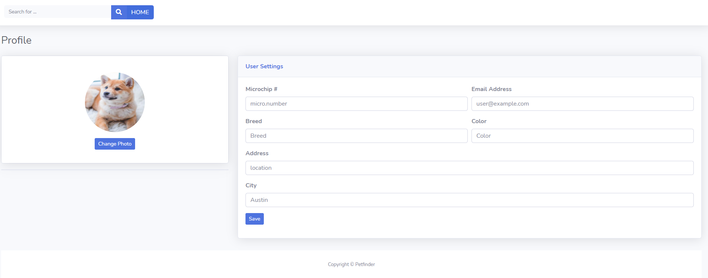
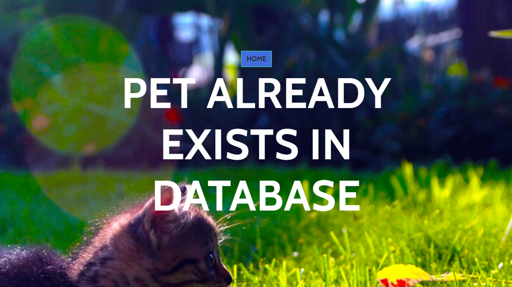
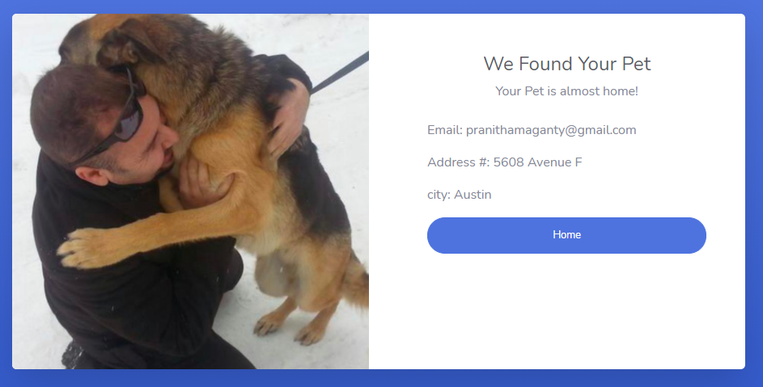

## Project: Petfinder
## Authors: Pranitha Maganty, Rima Odolski, Aro Reyes, Chris Searcy
### Description: Allows user to search for lost pets or enter information about a lost pet
### Github Repo Link: https://github.com/pmaganty/Pet-Finder
### Heroku Link: https://polar-stream-66961.herokuapp.com/ [NO LONGER SUPPORTED]

#### Preliminary to-do if running on local server:
+ Enter "npm i" to grab all dependency libraries
+ Run .sql file in sql server and change settings to access that server in config/config.json file (you should only need to change the password to your own)
+ run "node server.js" to open up application on localhost:3001

#### Application basics:

+ Homepage: has 3 buttons, 2 functioning ones
    - "I found a pet": Will take you to a form to enter information for the pet you found
    - "I lost a pet": Will take you to a form to enter information about the pet you lost
    
    
    - "View all pets": Not currently implemented, but would show all lost pets in the databse
+ Other information:
    - If the pet already exists in the database and you are:
        - NOT the owner: you will be told that the pet already exists and your information will not be added
        
        - the owner: you will be told that your pet has been found and will be given the contact information of the person who found your pet
        
    - This application searches based on microchip number. If no microchip number is provided, the databse cannot be searched.

#### All relevant file contents:
+ server.js: contains info to connect to server
+ package.json: contains all dependencies required for application to run
+ config/
    - config.json: contains info for connecting to sql server
+ schema.sql: contains commands to create database that must be run in a sql server
+ models/
    - person.js: contains code for creating a table using sequelize of all people who found or lost a pet
    - pet.js: contains code for creating a table using sequelize of all lost pets
+ public/assets: Folder containing css and images
+ public/: contains html pages we use to show user information on browser
+ views/: folder need to use handlebars to show information of person who found a pet
    - layouts/main.handlebars: main handle bar html page
    - index.handlebars: contains body of html for front end in handlebar format